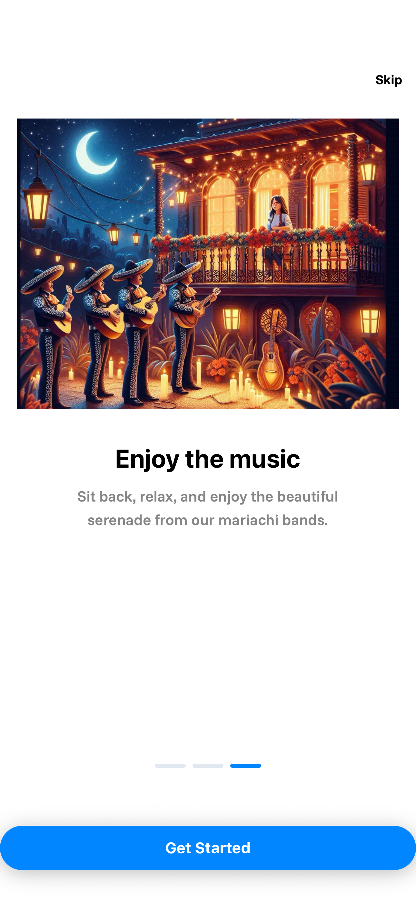

# Mariachi App

Mariachi App is a web application designed to help users manage mariachi events, bookings, and musicians. It leverages modern frontend and backend technologies, supports user authentication, and stores data securely in a relational database.

## ⚙️ Features

- Event and booking management
- Musician profiles
- User authentication
- Calendar integration
- Notifications

## 📸 Screenshots

- ### Onboarding
  
  
  
- ### Sign Up
  
- ### Sign In
  
- ### Home
  
- ### Google Autocomplete
  
- ### Choose Mariachi
  
- ### Making the book
  
- ### Payment
  
  
- ### After Payment
  

## Built With 🛠

- [Next.js](https://nextjs.org) - React-based frontend and backend framework
- [React Native](https://reactnative.dev) - Mobile app development framework
- [Clerk](https://clerk.com) - User authentication and management
- [Neon Database](https://neon.tech) - Serverless PostgreSQL database

## Prerequisites

- [NodeJS](https://nodejs.org/en/) version 22+
- [React Native](https://reactnative.dev)
- To test the mobile app, you can use [Android Studio](https://developer.android.com/studio?hl=en-419) to emulate Android devices, or use Expo Go app to use it on your own phone.

## 🚀 Getting Started

### 1. Install dependencies

```bash
npx expo install
```

### 2. Mobile App

To run the mobile app, use:

```bash
npx expo start
```

Follow the instructions in the terminal to open the app on an emulator or your device.

## Disclaimer

All images included in this project were generated using Artificial Intelligence (AI) tools.  
They are not real photographs and are intended solely for illustrative purposes.
